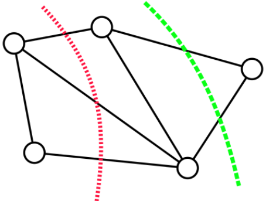
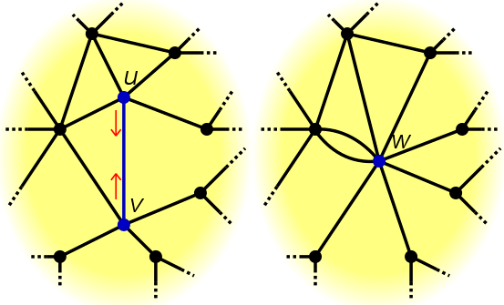

Contents

* TOC
{:toc}
----------

## Min Cut 
Min Cut 문제란, 어떤 그래프 $G = (V, E)$ 가 주어졌을 때, $V$의 정점들을 두 집합 $S, T$ 로 나누어서, $$\Setcond{(u, v) \in E}{u \in S, v \in T}$$ 즉, 한쪽 끝이 $S$에, 다른쪽 끝이 $T$에 들어가는 간선들의 개수를 최소화하는 문제입니다.
Weighted graph에서는 간선의 개수가 아니라 weight의 합을 최소화하는 문제로 바꾸어 생각하면 됩니다.

우리는 논의를 위해, 편의상 그래프를 unweighted connected의 경우로만 한정하겠습니다. Directed / Undirected는 (그림은 undirected로 그리더라도) 사실 문제 자체가 똑같습니다. 알고리즘의 측면에서는 조금 차이가 있으므로, 좀더 일반적인 directed graph의 경우를 생각하겠습니다.   

  

예를 들어 이 그림에서 빨간색 cut은 간선 3개짜리 cut이지만, 초록색 cut은 간선 1개짜리입니다.  

## s-t min cut
Min cut 문제의 variation 중 하나는, s-t min cut 이라는 문제입니다. 이 문제는 $s, t$ 라는 두 정점이 각각 $S, T$에 속해야 한다는 추가 제약조건이 걸린 min cut 문제입니다. 
- 매우 유명한 Max-Flow-Min-Cut Theorem에 의하면, s-t min cut 문제는 s-t max flow로 계산할 수 있습니다. 구체적으로, $s$ 에서 $t$로 가는 max flow와 $s-t$ min cut의 크기가 같다는 정리입니다.
- 이 정리의 핵심 아이디어는 두 문제를 각각 LP (Linear Programming) 문제로 바꾼 후, 두 LP를 비교하는 것입니다. 두 LP는 서로 primal-dual 관계에 있음을 알 수 있는데, Dual Linear Program의 Strong duality theorem에 의하면, LP의 경우 strong duality를 갖기 때문에 두 문제의 최적값, 즉 max-flow와 min-cut의 결과값이 같습니다. 
- Primal-Dual LP나 Strong duality에 대한 증명은 이 포스팅의 범위를 넘어가는 이야기이기 때문에 생략합니다. 궁금하다면 [^1] 을 참고. Farkas Lemma 등 알아야 할 내용이 상당히 많습니다. 
- Dinic의 알고리즘으로 max flow를 $O(V^2 E)$ 에 해결할 수 있고, $E$ 를 $V^2$ 까지 갈 수 있음을 감안하면[^2] 현재 실질적으로 가장 빠른 flow는 $O(V^3)$ 시간에 도는 알고리즘들이 있습니다. (Push-Relabel with FIFO)

이제, 일반적인 min cut을 풀고자 한다고 생각해 봅시다. 당연히, 모든 정점 페어를 $s, t$로 잡고 s-t min cut을 해보는 방법을 생각할 수 있으므로, 우리는 적어도 $O(V^5)$ 알고리즘을 가지고 있습니다. 이보다 나은 방법을 생각해 봅시다.

## Karger's Algorithm
지금은 MIT의 교수로 계신 Prof. David R Karger가 제시한 Karger's Algorithm은 Edge contraction이라는 연산에 기반하는, 매우 간단하고 elegant한 알고리즘입니다. 

### Edge contraction
Edge contraction이란, 말 그대로 edge 양쪽 끝을 접합하는 연산입니다. Edge $e = (u, v)$를 contract한 그래프 $G / e$ 는 다음과 같은 과정을 통해 만들어집니다.

- $(u, v)$ 의 양쪽 vertex $u$ 과 $v$를 합쳐 하나의 vertex $w$를 만듭니다.
- $(u, x)$ 나 $(v, x)$ 가 있으면 이걸 모두 $(w, x)$ 로 만듭니다. 이때, parallel edge는 허용되어야 합니다. [^3]
- 같은 방법으로 $(x, u), (x, v)$ 에 대해서도 같은 과정을 거칩니다. 
- 단, $(u, v)$ 간선은 삭제합니다. self loop은 

예를 들어 이런 식입니다. 그림을 보면 거의 바로 이해가 갈듯 합니다. 
  

### Algorithm
Karger's Algorithm은 정말 어이가 없을 정도로 간단합니다. 
- Edge Contraction을 계속 진행해서, 노드 두개와 그 노드 두개 사이의 간선 $k$ 개가 남았다고 합시다. 
- 재미있는 사실은, 우리의 Edge contraction은 사실 `이 두 정점은 같은 집합에 있다` 라고 처리하는 것과 동치입니다. 
- 따라서, 남은 두개의 정점 $a, b$에 대해 `a로 합쳐진 정점의 집합` 과 `b로 합쳐진 정점의 집합` 을 $S, T$로 삼으면, 마지막 순간에 $a, b$를 잇는 $k$개의 간선이 cut edge가 됩니다. 
- 그러므로, 정점을 무작정 랜덤하게 줄여나가다가 2개가 남으면 (min cut은 아니겠지만) cut을 하나 얻습니다. 
- 우리는, 이걸 충분히 많이 반복하면 min cut을 얻을 확률이 충분히 높음을 논증하고자 합니다. 구체적으로, 이렇게 cut을 하나 얻는 과정까지를 $q$ 번 반복하여, 그동안 얻은 cut들 중 가장 작은 (간선이 적은) cut을 취하는 것을 생각하겠습니다.  

### Proof 
min cut의 크기를 편의상 $K$ 라고 하고, 실제 cut edge의 집합을 $C$라고 하겠습니다. 이제, 위 알고리즘이 C를 반환할, 즉 올바른 답을 제공할 확률은 $K$개의 Edge가 $n-2$번의 contraction을 모두 살아남아야 합니다. 각 contraction에서는 남은 edge들 중 하나를 `임의로` contraction해버리므로, 매 스텝을 모두 살아남을 확률은 
$$\prod_{i = 0}^{n-3} \left(1 - \frac{K}{E - i}\right)$$
이렇게 계산됩니다. 그런데, $\frac{K}{E - i}$ 는 잘 생각해보면 좋은 바운드를 잡을 수 있습니다. 

Contraction을 진행하는 과정 중 한 번이라도 만약 어떤 정점 $u$ 가 $d_u < K$ 를 만족한다면, $u$ 와 나머지를 자르는 cut의 크기가 $d_u$ 가 되기 때문에, 정의로부터 모든 정점의 degree는 $K$보다 언제나 크게 됩니다. 따라서 $i$번째 contraction 이전 남은 정점이 $n - i$개이므로 전체 edge의 개수는 $\frac{K(n-i)}{2}$ 개보다 크고, 위 확률 계산은 
$$p_{success} \geq \prod_{i = 0}^{n-3} \left(1 - \frac{2}{n - i}\right) = \frac{1}{\binom{n}{2}}$$
이렇게 계산되게 됩니다. 

[^1]: Stephen Boyd, Lieven Vandenberghe, *Convex Optimization*, Chapter 4
[^2]: Sparse graph에 대해서는 Orlin 등 더 빠른 알고리즘들이 있지만, 우선은... 
[^3]: Edge contraction을 정의할때 edge가 겹치면 하나만 남기는 저자들이 있는데, 저희는 그러지 않겠습니다.